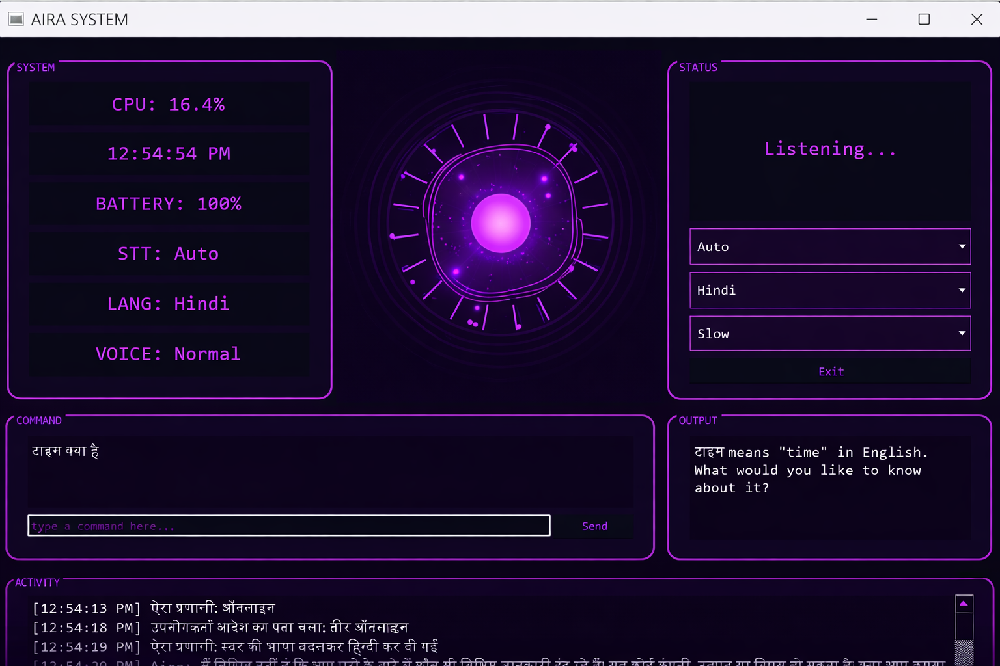

# Aira AI Assistant


Aira is a Windows-first desktop voice assistant with a Jarvis-inspired PyQt interface, multilingual speech flow, local Ollama support, and a one-command installer.

It is designed to be practical on a real PC: voice and typed commands, live language switching, offline or online speech recognition, local or fallback speech synthesis, and automatic Ollama model selection based on the machine it is installed on.

## Highlights
- Jarvis-style desktop UI with arc-reactor inspired visuals
- Voice commands plus typed command fallback
- Multilingual speech flow for English, Hindi, Kannada, and Telugu
- Online Google STT with Vosk offline fallback
- Cloud, Piper, and Windows voice fallback chain
- Ollama model auto-selection based on RAM, CPU, and free storage
- Windows installer script for first-run setup

## Demo Flow
- Clone the repo
- Run `.\install.ps1`
- Let the installer fetch Python packages, models, and an Ollama model
- Start Aira with `python -m app.main`
- Speak or type commands such as time, battery, Notepad control, and multilingual prompts

## Screenshots

```md

```
<p align="center">
  
</p>

## Features
- Voice and typed commands
- Arc-reactor styled GUI
- System monitoring for CPU, time, battery, STT mode, language, and voice speed
- Online Google STT with language switching
- Vosk offline fallback when installed
- Cloud/local TTS fallback chain
- Ollama local model support with hardware-based installer selection

## Quick Install

Recommended for Windows PowerShell:

Run the Windows installer:

```powershell
.\install.ps1
```

What it does:
- upgrades `pip`
- installs Python dependencies from `requirements.txt`
- downloads the Vosk and Piper model files
- configures local Piper paths in `.env`
- installs Ollama with `winget` if needed
- checks RAM, storage, and CPU cores
- picks an Ollama model automatically:
  - `mistral:latest` for stronger systems
  - `qwen2.5:3b` for mid-range systems
  - `llama3.2:latest` for lighter systems
  - `tinyllama:latest` for low-spec fallback
- writes the selected model into `.env`

## Installer Options

```powershell
.\install.ps1 -OllamaModel qwen2.5:3b
.\install.ps1 -SkipOllama
.\install.ps1 -SkipModelDownloads
.\install.ps1 -Python py
```

You can also run the Python installer directly:

```powershell
python installer.py --ollama-model auto
```

## Fresh Clone Setup

```powershell
git clone <your-repo-url>
cd A.I.R.A_main
.\install.ps1
python -m app.main
```

## Run

```powershell
python -m app.main
```

## Example Commands

- `what time is it`
- `battery`
- `open notepad`
- `write hello world in notepad`
- `mera naam kya hai`
- `ಸಮಯ ಎಷ್ಟು`
- `టైమ్ ఎంత`
- `exit`

## Environment

Copy `.env.example` to `.env` if you want to configure manually.

Important settings:
- `ASSISTANT_NAME`
- `LISTEN_MODE`
- `VOSK_MODEL_PATH`
- `PIPER_MODEL`
- `PIPER_CONFIG`
- `PIPER_EXE`
- `USE_OLLAMA`
- `OLLAMA_MODEL`
- `USE_OPENAI`
- `OPENAI_API_KEY`

## Notes About Piper

- the installer always sets up the Python `piper-tts` package and downloads the default voice model
- if you also place `piper.exe` at `tts/piper/piper.exe`, Aira can use it as an extra fallback
- `piper.exe` is optional, not required for the project to run

## Ollama Model Selection

The installer auto-selects a model based on detected hardware:
- stronger systems: `mistral:latest`
- mid-range systems: `qwen2.5:3b`
- lighter systems: `llama3.2:latest`
- low-spec fallback: `tinyllama:latest`

You can override that manually:

```powershell
.\install.ps1 -OllamaModel mistral:latest
.\install.ps1 -OllamaModel qwen2.5:3b
```

## GitHub Project Notes

Recommended repo contents:
- commit `install.ps1`
- commit `installer.py`
- commit `.env.example`
- do not commit your real `.env`
- do not commit downloaded `models/` or `tts/piper/` assets
- do not commit generated `tts/output/` audio files

## Push To GitHub

If this folder is not connected to your repo yet:

```powershell
git init
git add .
git commit -m "Initial Aira desktop assistant project"
git branch -M main
git remote add origin <your-repo-url>
git push -u origin main
```

If the repo is already connected:

```powershell
git add .
git commit -m "Prepare Aira project for GitHub with installer"
git push
```
